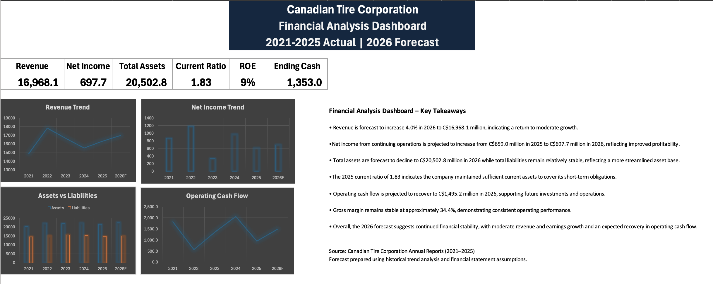

# Canadian Tire Corporation – Financial Analysis

## Project Overview

This project analyzes the financial performance of Canadian Tire Corporation using historical financial statements from 2021–2025 and a forecast model for 2026.

The analysis was built entirely in Microsoft Excel and includes historical financial statement reconstruction, financial ratio analysis, financial forecasting, and an executive dashboard.

## Project Components

- Historical Income Statement (2021–2025)
- Historical Balance Sheet (2021–2025)
- Historical Cash Flow Statement (2021–2025)
- Financial Ratio Analysis
- 2026 Forecast Model
- Executive Financial Dashboard

## Key Financial Insights

- Revenue is forecast to increase 4.0% in 2026 to approximately C$16.97 billion.
- Net income from continuing operations is projected to increase from C$659.0 million in 2025 to C$697.7 million in 2026.
- Operating cash flow is projected to recover to approximately C$1.50 billion in 2026.
- Gross margin remained relatively stable at approximately 34% over the historical period.
- The analysis indicates moderate revenue and earnings growth under the forecast assumptions.

## Skills Demonstrated

- Microsoft Excel
- Financial Statement Analysis
- Financial Ratio Analysis
- Financial Forecasting
- Three-Statement Financial Analysis
- Data Visualization
- Financial Dashboard Design
- Analytical Thinking

## Data Source

Financial information was obtained from Canadian Tire Corporation annual reports for fiscal years 2021–2025.

The 2026 forecast represents an independent financial analysis prepared for educational and portfolio purposes and is based on historical trends and stated assumptions.

## Dashboard Preview

## Author

Djabir Dauhoo  
Accounting and Financial Management  
University of Waterloo
